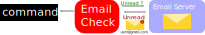

# What is EmailCheck ?


Email check is a portable application that execute command when you have unread messages in your inbox.    
You can customized which command is execute depending on the email address.    
It is available for **Windows** / **Raspberry Pi**.


[Downloads]()

# Settings
To configure your email address/password in emailcheck, you will have to 
modify settings.ini

Here is the default settings file.
```
[email]
server=imap.gmail.com
user=user@gmail.com
password=myPassword
interval=15

[empty]
command=echo "Empty Inbox"

[any]
command=echo "Any Email"

[list.example.org]
command=echo "Mailing list"

[user@gmail.com]
command=echo "Email"
```

* [empty] : This command will be execute when the inbox is empty 
* [any] : This command will be execute if an unread email is in the inbox and from address is unknown
* [user@gmail.com] : This command will be execute when an unread email from user@gmail.com is the last email in the inbox
* [list.example.org] : This command will be execute when an unread email from the mailing list list.example.org is the last email in the inbox

# Usage

## Open gmail when you have an important email
This settings will open your default browser on gmail.com.   
You can use this settings to start any application you want.

```
[musk@boringcompany.com]
command=explorer "https://mail.google.com"
```


## Control leds (websocket)


You can also control leds using libreConnect!    
But you will need **ws_send** to send commands thought a websocket.    
```
[any]
command=ws-send.exe --url "ws://localhost:42001" --message "/on"

[empty]
command=ws-send.exe --url "ws://localhost:42001" --message "/off"
```

## And much more!
You can pretty much do anything, using **curl** , you can for example, control home automation
system or anything using a REST API.   

# Compilation
This application was made using python and pyinstaller
You can compile it as an executable for your current operating system using this command.

```
pip install pyinstaller
pyinstaller emailCheck.py --onefile --icon=ico.ico
```

# Licence
* emailCheck.py - MIT - Rémi Sarrailh
* Icon: Creted by Kidiladon from Noun Project

